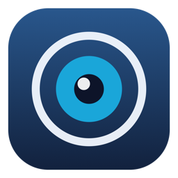
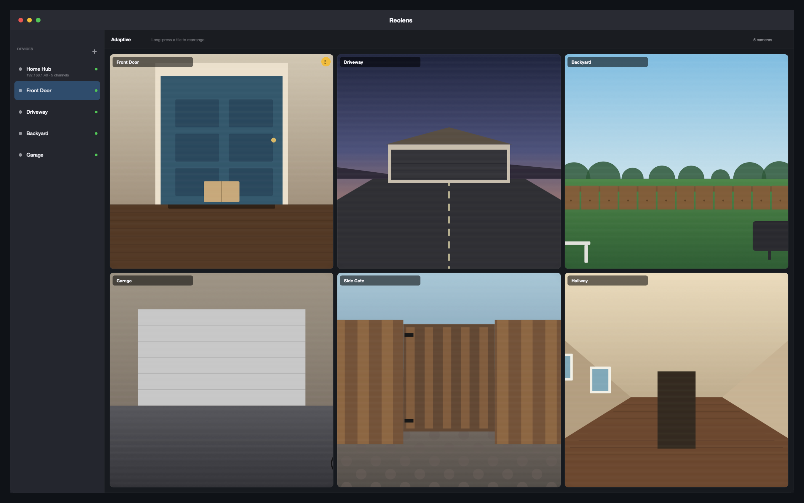
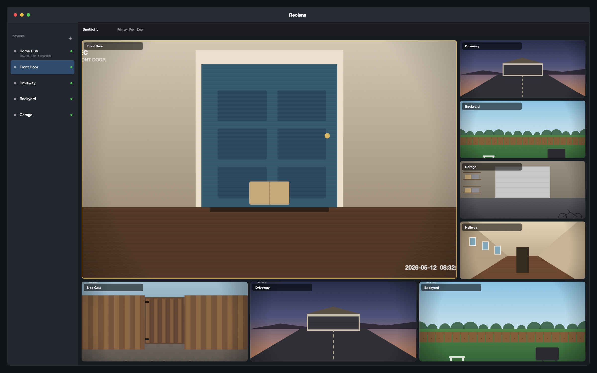
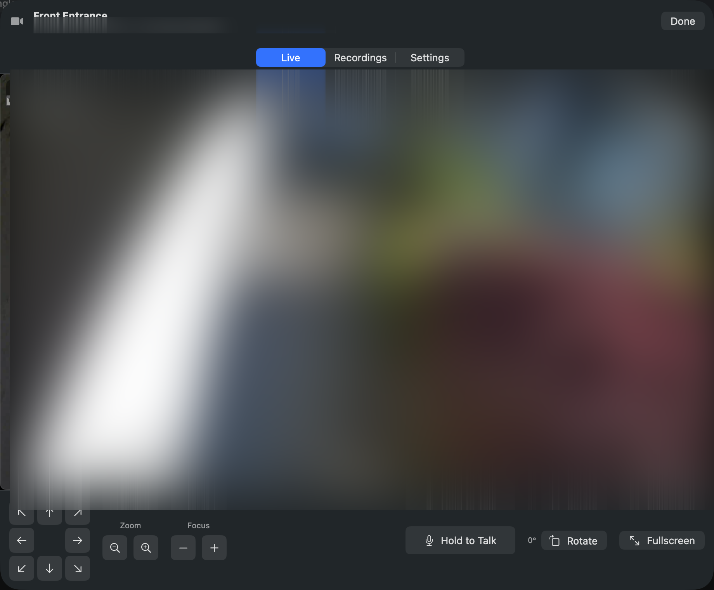
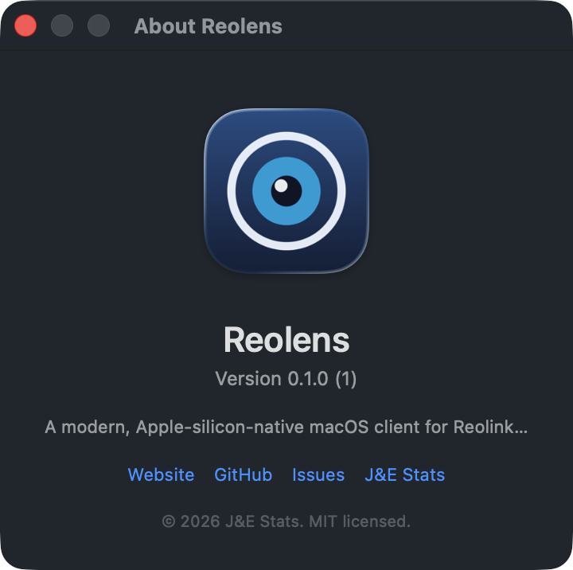

<h1 align="center">
  <br>
  Reolens
</h1>

<p align="center">
  A native client for Reolink cameras, NVRs, and Home Hubs — on Mac, iPad, and iPhone.
</p>

<p align="center">
  <a href="https://github.com/jestatsio/reolens/actions/workflows/ci.yml"></a>
  <a href="https://github.com/jestatsio/reolens/releases/latest"></a>
  <a href="LICENSE"></a>
  
  
</p>

<p align="center">
  <a href="https://reolens.io">Website</a> ·
  <a href="https://github.com/jestatsio/reolens/releases/latest/download/Reolens.dmg">Download</a> ·
  <a href="#install">Install</a> ·
  <a href="CHANGELOG.md">What's new</a> ·
  <a href="https://github.com/jestatsio/reolens/issues">Issues</a>
</p>

---

Reolens is a native app for watching your Reolink cameras. SwiftUI,
Swift 6, AVFoundation / VideoToolbox — no Electron, no Java, no
QtWebEngine. Cold launches in under a second; feels like every other
native Apple app on each platform.

It runs entirely on your devices. No Reolens server, no third-party
analytics, no telemetry, no accounts.



> The footage in marketing screenshots is procedurally rendered (a
> small Swift script generates "stock" camera scenes) rather than
> real captures — privacy-clean, license-clean, and still
> representative of what the app looks like in use.

## Install

### macOS — Homebrew (recommended)

```sh
brew tap jestatsio/reolens
brew install --cask reolens
```

Updates are handled by Sparkle inside the app — no `brew upgrade` needed.

### macOS — Direct download

Grab the signed, notarized DMG from the [latest release](https://github.com/jestatsio/reolens/releases/latest):

```
https://github.com/jestatsio/reolens/releases/latest/download/Reolens.dmg
```

Drag **Reolens.app** to your Applications folder and launch.

### iPad / iPhone — TestFlight

```
https://testflight.apple.com/join/2Pk2Anfz
```

### Build from source

```sh
git clone https://github.com/jestatsio/reolens.git
cd reolens
./Scripts/build-app.sh run      # macOS — builds + signs + launches
cd AppiOS && xcodegen generate  # iOS — then open in Xcode 26
```

Requires Xcode 26 + Swift 6.2.

## Quick start

1. **Launch Reolens.** It asks for Local Network permission (needed to
   reach your cameras) and Notification permission (for motion alerts).
2. **Click the + in the sidebar** to add a camera. Enter the IP address
   (or hostname), username, and password — the rest is auto-detected.
3. **Pick a camera in the sidebar** to view it. Use the layout picker
   in the toolbar to switch between adaptive / spotlight / 2×2 / 3×3 /
   4×4 grids.

Drag tiles to rearrange them. Right-click a tile for "Make primary",
"Rotate", and per-channel settings.

## What you get

### Live viewing
- **Multi-camera grids** with adaptive layout, spotlight, and fixed 2×2
  → 5×5 presets. Drag-and-drop reorder. Per-camera rotation.
- **Hardware-decoded RTSP** (H.264 / H.265) via VideoToolbox. FLV / JPEG
  fallback when the stream renegotiates.
- **Picture-in-Picture, pinch-to-zoom, drag-to-pan** on iOS / iPadOS.
- **Two-way talkback** on supported cameras.
- **Full PTZ** — all 17 ops (pan / tilt / zoom / focus / presets /
  patrols) from a dedicated control bar.
- **Battery cameras** wake on the first tap; the single-camera detail
  view auto-wakes on appear so you don't tap twice.

### Recordings
- **Per-camera Recordings tab** with a day-density calendar, a per-day
  timeline strip with AI-event ticks, and a player that scrubs with a
  thumbnail rail.
- **All Recordings** view that fans across every channel — and across
  hubs — into one chronological feed. Filter by AI tag or by camera.
- **Cross-day natural-language search** ("packages this week",
  "vehicles yesterday at the driveway"). Runs through Apple's on-device
  `FoundationModels` when available (no recording data crosses the
  model boundary — just the prompt); otherwise a deterministic regex
  parser.
- **Bookmarks** — long-press / right-click / swipe to bookmark without
  playing. The clip downloads in the background so it's available
  offline; Wi-Fi by default, cellular toggle in Settings.

### Notifications
- **Rich motion / AI notifications** with the trigger frame, not just
  text. Tap to jump straight to the clip.
- **CloudKit-relayed background pushes** to iOS / iPadOS — events ride
  through *your own* iCloud private database, no Reolens server.
- **Per-camera mute** (default on, iCloud-synced) and **per-AI-tag
  filters**. **Notification diagnostics** screen + a 1,000-record
  rolling **notification log** so silent-push issues are self-
  diagnosing. **Overnight digest** — local notification at a user-
  configurable hour summarizing the previous day's events.

### Schedules
- **Recording schedule editor** — visual 7×24 weekly grid of when each
  camera writes to storage. Reads / writes via Reolink's `Rec` CGI
  command; degrades to read-only on firmware that doesn't expose it.
- **Motion-detection schedule** with **per-AI-tag overrides** — set
  the channel-level "when can alarms fire" window, then override per
  tag (e.g. quiet `vehicle` overnight while still alerting on
  `people`).
- **Motion privacy zones** — draw rectangles on the live frame;
  written back via `SetMask` with graceful local-only fallback.

### Platform polish
- **Stage Manager / multi-window** on iPad + macOS. "Open in New
  Window" on any camera row.
- **Home Screen / Lock Screen / Control Center widgets** on iOS /
  iPadOS; desktop widgets on macOS.
- **Live Activities + Dynamic Island** on iOS for in-flight motion
  events. Hub-grouped — multiple events on the same hub merge into
  one Live Activity rather than stacking.
- **Liquid Glass throughout** — toolbars, sidebars, chips, badges,
  popovers, sheets, HUDs all use the iOS 26 / macOS 26
  `.glassEffect()` material via centralized design tokens.
- **iCloud sync** — camera list, grid layout, channel order, and
  rotations sync across your Apple devices. Passwords stay per-
  device in Keychain by default; optional iCloud Keychain sync is in
  Settings.
- **Shortcuts & Siri** — "Hey Siri, open the Front Door camera in
  Reolens." Three App Intents: Open Camera, Show Today's Events,
  Mute Camera Notifications.
- **Auto-updates** — Sparkle in-app on macOS, TestFlight on iOS.

For the full feature surface and the per-release history, see
[CHANGELOG.md](CHANGELOG.md).

## System requirements

- **macOS 26 Tahoe or later** on Apple Silicon or Intel
- **iPadOS 26 / iOS 26 or later** on any device that runs them
- **A Reolink camera, NVR, or Home Hub** reachable on the local network
- **HTTP / HTTPS access** to the device's CGI port (default 80 / 443)

Users on macOS 14 / iOS 18 should stay on the 0.4.x security-backport
track. See [SECURITY.md](SECURITY.md). FoundationModels-driven
features (the Today digest, NL search) fall back to deterministic
implementations on devices without Apple Intelligence.

## Screenshots

| | |
|---|---|
|  |  |
| Adaptive multi-camera grid | Spotlight layout |
|  |  |
| Detail view with full PTZ controls | About panel — version + Check for Updates |

## Privacy

Reolens runs entirely on your devices. The network surface is:

- Your Reolink cameras, NVRs, and Home Hubs (over the local network)
- iCloud Drive — syncs your camera list across *your own* Apple devices
- iCloud CloudKit — relays motion-event pushes between your devices
  (private database, never touches Apple's public surface)
- `reolens.io/appcast.xml` (macOS only, for Sparkle update checks; can
  be disabled in Settings)
- Apple's TestFlight / App Store (iOS, for app updates)

That's it. No third-party analytics. No remote crash reporting. No
telemetry. No accounts.

**Credentials are device-local.** Camera passwords live in each
device's Keychain (`kSecAttrSynchronizable: false` — explicitly never
synced), and the iCloud Drive sync carries only metadata (display
name, host, port, username, grid layout). The full credential model
is documented in [AGENTS.md](AGENTS.md) §3, §4.

## Architecture

```
┌──────────────────────────────────────────────────────────────────┐
│ App (SwiftUI views, @Observable state, ReolensApp / RootView)    │
│ AppiOS/ (iOS twin) + Widget extensions + Live Activity ext.      │
├──────────────────────────────────────────────────────────────────┤
│ AppShared (CameraStore split, RecordingsLoader, RecordingIndex,  │
│            PollManager, EventNotifier, RelayDiagnostics,         │
│            SharedContainer, ReolensGlass design tokens, …)       │
├──────────────────────────────────────────────────────────────────┤
│ ReolinkBaichuan (port 9000: talkback, alarm push, findAlarmVideo)│
│ ReolinkStreaming (RTSP + VideoToolbox + H.264 / H.265 + SDP)     │
├──────────────────────────────────────────────────────────────────┤
│ ReolinkAPI (CGI client, Commands, Codable models, StreamURLs)    │
└──────────────────────────────────────────────────────────────────┘
```

Dependency-only-downward. `ReolinkAPI` ships standalone — no UI deps,
testable in isolation. `AppShared` is the cross-platform behaviour
layer driving the macOS app, the iOS / iPadOS app, both widget
extensions, and the Live Activity extension.

Key concurrency primitives:

- `CGIClient` is an **actor** — one instance per camera. Reolink
  devices have a notoriously small global session cap, so the actor
  serializes login / refresh and reuses one token across all commands.
- `CameraSession` is `@MainActor`-isolated and `@Observable` — SwiftUI
  views observe its state directly.
- `RecordingsLoader` is an `@MainActor @Observable` class with a
  generation counter so a rapid date-flip never publishes stale
  results on top of the latest reload.
- `PollManager` owns the motion-event polling lifecycle separately
  from `CameraSession` with a depth-counted pause/resume primitive.

See [AGENTS.md](AGENTS.md) for the engineering principles that gate
every change (platform parity by default, no telemetry, no
credentials in logs) and [AppiOS/README.md](AppiOS/README.md) for the
iOS-specific project layout.

## Repository layout

```
Package.swift            — SwiftPM manifest (libs + macOS executable + tests)
App/                     — macOS SwiftUI executable
  ReolensApp.swift       — @main, About panel, Check-for-Updates menu
  Views/                 — sidebar, grid, detail, PTZ, settings, scrubber,
                           bookmarks, schedule editors, About
  Widgets/               — macOS desktop WidgetKit extension target
AppiOS/                  — iOS / iPadOS Xcode project (xcodegen-managed)
  Sources/               — RootView, iPadSplitShell, iPhoneTabShell,
                           SingleChannelView, LiveActivities/
  Widgets/               — iOS WidgetKit + Control Center + ActivityKit
                           extension target (5 widget surfaces total)
  UITests/               — XCUITest baseline journeys
  project.yml            — xcodegen spec; run `xcodegen generate` after edits
Sources/
  AppShared/             — cross-platform behaviour layer
  ReolinkAPI/            — CGI client + Codable models + StreamURLs
  ReolinkStreaming/      — RTSP / VideoToolbox / H.264 + H.265 / SDP
  ReolinkBaichuan/       — port-9000 protocol (talkback, push, alarms)
Tests/                   — ~340 tests across 68 suites
Scripts/                 — build, sign, notarize, DMG, icon generation,
                           coverage gate, version-check gate
docs/                    — reolens.io landing page (GitHub Pages),
                           RELEASE.md + IOS_RELEASE.md runbooks
dist/homebrew/reolens.rb — Homebrew cask formula template
.github/workflows/
  ci.yml                 — build + test + smoke launch + coverage gate
                           + iOS XCUITest job
  release.yml            — on tag push: build → notarize → DMG → release
```

## Development

```sh
swift build               # libs + macOS app
swift test                # ~340 tests across 68 suites
./Scripts/build-app.sh run # bundled .app (needed for Local Network access)
```

CI gates (also runnable locally):

```sh
bash Scripts/check-versions.sh  # macOS + iOS marketing versions must match
bash Scripts/coverage-gate.sh   # per-target coverage regression gate
```

### Release process

See [docs/RELEASE.md](docs/RELEASE.md) for the full runbook. Short version:

1. Bump `CFBundleShortVersionString` in [App/Info.plist](App/Info.plist)
   and the matching `MARKETING_VERSION` in
   [AppiOS/project.yml](AppiOS/project.yml). The check-versions gate
   blocks PRs that drift.
2. Add a section to [CHANGELOG.md](CHANGELOG.md).
3. `git tag v0.6.0 && git push --tags`.
4. Watch [.github/workflows/release.yml](.github/workflows/release.yml)
   build, notarize, package the DMG, regenerate the appcast, and
   publish.

## Contributing

PRs welcome. Before opening one, read [AGENTS.md](AGENTS.md)
(engineering principles — platform parity, device-local credentials,
no third-party analytics) and [CONTRIBUTING.md](CONTRIBUTING.md)
(dev setup, test expectations, commit conventions).

Security issues: please use the private reporting flow described in
[SECURITY.md](SECURITY.md) rather than filing a public issue.

## License

MIT — see [LICENSE](LICENSE).

Reolink is a trademark of Reolink Innovation Inc. Reolens is an
unaffiliated third-party client. The Reolink protocol is reverse-
engineered from public CGI documentation and community projects:

- Reolink CGI v1.61 reference PDF
- [starkillerOG/reolink_aio](https://github.com/starkillerOG/reolink_aio) (Python ref, used by Home Assistant)
- [thirtythreeforty/neolink](https://github.com/thirtythreeforty/neolink) (Rust ref for Baichuan)
